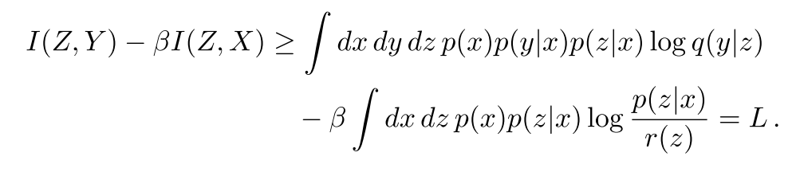
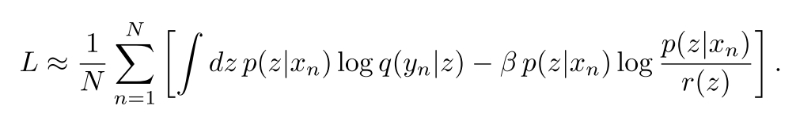

# Deep Variational Information Bottleneck
<br>

### Overview
Pytorch implementation of Deep Variational Information Bottleneck([paper], [original code])



<br>

### Dependencies
```
python 3.6.4
pytorch 0.3.1.post2
tensorboardX(optional)
tensorflow(optional)
```
<br>

### Usage
1. train
```
python main.py --mode train --beta 1e-3 --tensorboard True --env_name [NAME]
```
2. test
```
python main.py --mode test --env_name [NAME] --load_ckpt best_acc.tar
```
<br>

### References
1. Deep Learning and the Information Bottleneck Principle, Tishby et al.
2. Deep Variational Information Bottleneck, Alemi et al.
3. Tensorflow Demo : https://github.com/alexalemi/vib_demo

[paper]: http://arxiv.org/abs/1612.00410
[original code]: https://github.com/alexalemi/vib_demo
